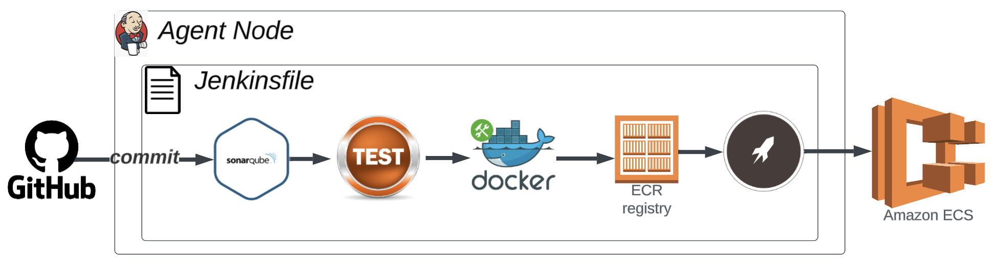
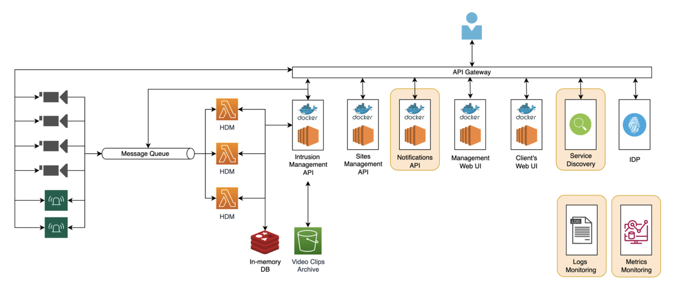

# Purpose
University of Aveiro. Project in Software Engineering Master's class, groups of 5. This repo comprises of AWS ECS JSON configuration files, that might be useful in the future.

This project tackled the development of a software solution for a security company named SecCom. SecCom was an imaginary company that ensured critical buildings are not broken into, through the installation and operation of CCTV cameras on-premises. Our goal was to implement this system in a cloud environment.

# Key Takeaways
By organizing our teamwork with the *SCRUM* framework and *DevSecOps* methodology, we were able to deploy a **scalable and monitored** solution that met client's requirements to a cloud environment in a secure way.

# Jenkins CI/CD
CI/CD was designed and implemented as follows:
1. CI/CD server listens for a webhook.
2. A webhook triggers the pipeline. Depending on the branch's regex, the pipeline runs accordingly.
3. Project application's were integrated with continuous code inspection tool. It allowed us to automate metrics like: code coverage, or basic security defects.
4. Application Tests runs in a containerized, specifically designed for this purpose, ephemeral environment.
5. Build and Tag Application Image.
6. Push Application's Tagged Image to an Elastic Container Registry(ECR), in the cloud.
7. **Finally:** Using Elastic Compute Cloud(ECS), the tasks were deployed.

# Agile - SCRUM
- During this we had been following SCRUM framework for 4 months.
- Identification of User Requirements allowed us to organize our teamwork and distribute the tasks across team members to maximize team's efforts.
- Definition of Ready allowed us to measure if a task was completed.

# Deployment diagram

